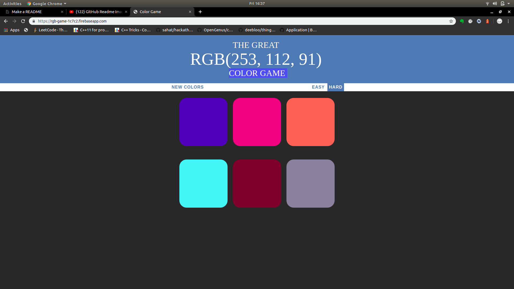
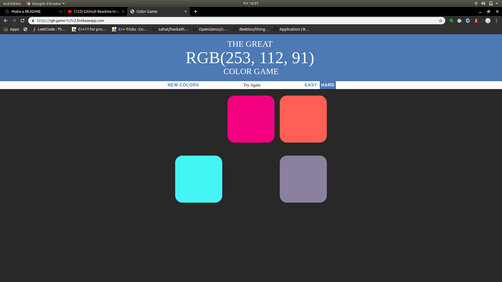
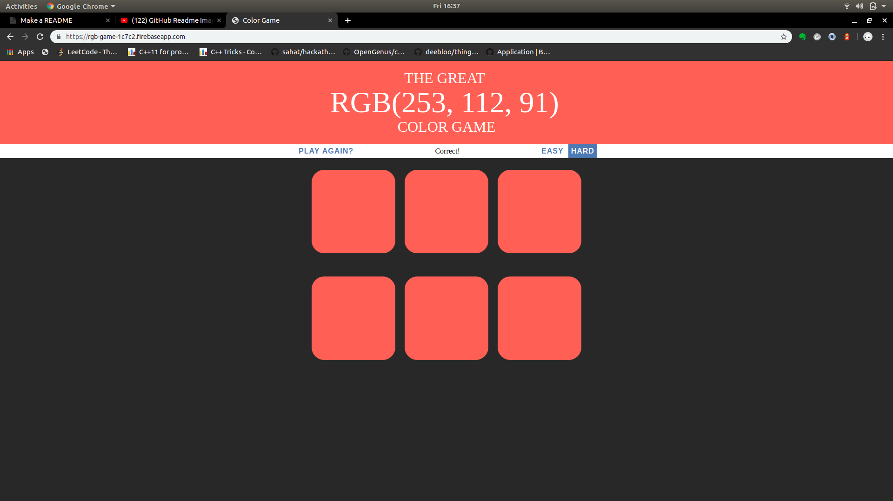

# color-game

A simple JS game to guess the correct color from the given RGB value.
In case you wanna play it.
Follow the link.
[THE GREAT RGB GAME](https://rgb-game-1c7c2.firebaseapp.com)

## Hosting 

As you might have discovered, it is hosted in Google Firebase.

## Features and Description

I have managed to make it a [PWA](https://developers.google.com/web/progressive-web-apps) which make it easy to install(add to home screen) on your device making it more engaging and it works offline as well!

Some screensots might help you on the way.

There are currently two levels in the game.

You click on the boxes. If it's wrong, it will disappear.

If it is correct. Voila!! Everything turns that into that color.

